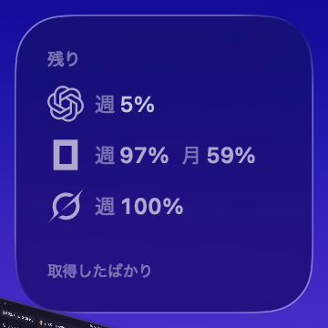
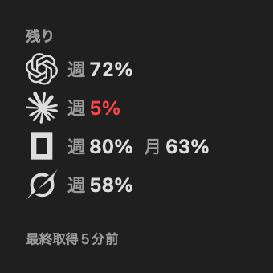
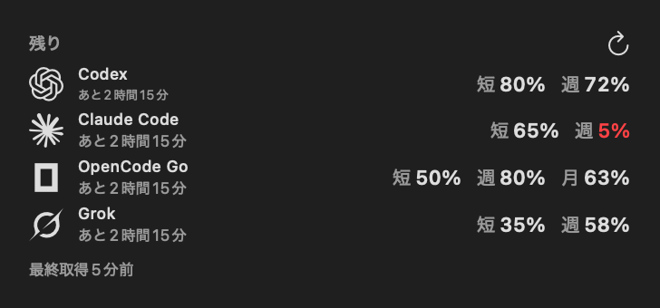
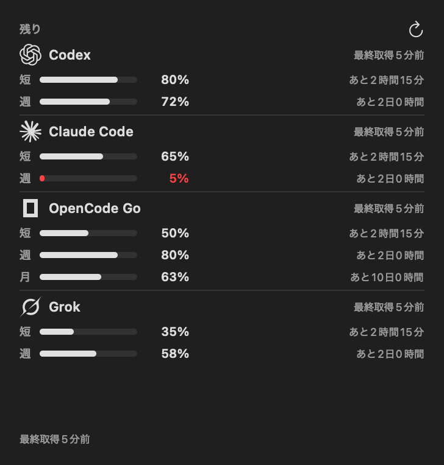

# AI Usage for Mac

Codex・Claude Code・OpenCode・SuperGrokの**定額プランの残り利用枠**を、macOSのデスクトップに常時表示するウィジェットアプリです。  
ブラウザで使用状況ページを毎回開き直すことなく、各サービスの残り割合やリセットまでの時間をひと目で確認できます。

<p align="center">
  
</p>

### 主な特徴
- 📊 **残り枠を一元管理**：各サービスの残り枠（%）とリセットまでの時間をまとめて確認（使用率ではなく「残り」を表示）。
- 🔑 **既存のログインを活用**：Codex・Claude Code・Grok のCLIでログイン済みなら、追加ログインなしですぐ使えます。
- 🧩 **選べる3サイズ**：デスクトップや通知センターに合わせて、小・中・大の3サイズから選べます（ライト/ダーク両対応）。
- 🛡️ **安全なローカル完結**：認証情報は外部サーバーを介さず、お使いのMac（Keychain等）で安全に管理されます。
- ⚙️ **1サービスから利用可能**：契約しているサービスだけを選んで表示できます（未設定のサービスは非表示）。

---

## ウィジェットの3サイズ

スペースや確認したい情報量に合わせて、3つのサイズを用意しています。

| 小（Small） | 中（Medium） | 大（Large） |
| :---: | :---: | :---: |
|  |  |  |
| **残枠をコンパクトに**<br>最大4サービスの残り枠を一覧 | **短時間枠もまとめて**<br>短期枠と週間/月間枠をすっきり併記 | **詳細までしっかり把握**<br>視覚的な残量バーとリセット時間を表示 |

*※ macOSの外観設定（ライトモード / ダークモード）に自動連動します。*

---

## 対応サービス

| サービス | 接続に必要なもの | 表示される情報 |
| --- | --- | --- |
| **Codex** | Codex CLIのChatGPTログイン (`codex login`) | 週・月などの利用枠、モデル別制限 |
| **Claude Code** | Claude CLIのログイン (`claude auth login`) | 短時間枠、週間枠など取得可能な利用枠 |
| **OpenCode** | OpenCode ConsoleのAPIキー | Go定額枠（Zen API残高とは別） |
| **SuperGrok** | Grok CLIのログイン (`grok login`) | 契約利用枠 |

---

## はじめかた

**動作要件:** macOS 14 (Sonoma) 以降

### 1. アプリを起動する
ビルドした `MacAIUsage.app` を `/Applications` または `~/Applications` に配置して起動します。  
（起動するとメニューバーにアイコンが常駐します）

### 2. 使いたいサービスを接続する
メニューバーアイコンから **「接続設定」** を開きます。

| サービス | 事前準備 |
| --- | --- |
| **Codex** | ターミナルで `codex login` を実行 |
| **Claude Code** | ターミナルで `claude auth login` を実行（※`setup-token`は権限不足のため不可） |
| **OpenCode** | [OpenCode Console](https://opencode.ai/auth) でAPIキーを発行・入力 |
| **SuperGrok** | ターミナルで `grok login` を実行し、SuperGrokアカウントでログイン |

設定画面で **「接続確認」** をクリックします。ClaudeのKeychainアクセスを求められたら許可してください。「使用状況」に残り枠が表示されれば接続完了です。

### 3. ウィジェットを追加する
1. デスクトップを右クリック（または通知センター下部）して **「ウィジェットを編集」** を開きます。
2. リストから **「AI Usage」** を検索します。
3. お好みのサイズ（小・中・大）を選んでデスクトップに配置します。

> **Tip:** 「接続設定」で **「ログイン時に起動」** をオンにしておくと、Mac起動時に自動で常駐します。

---

## 日常の使い方

- **残量の確認:** デスクトップのウィジェットで確認できます。さらに詳しい内訳はメニューバーの「使用状況を表示」から見られます。
- **今すぐ更新:** メニューバーの「今すぐ更新」、または中・大ウィジェット上の「更新ボタン」をクリックします。
- **自動更新:** 約20分ごとにバックグラウンドで自動取得されます。  
  *(※WidgetKitの仕様上、画面への実際の反映タイミングはmacOSが管理します)*

---

## セキュリティとプライバシー

- **ローカル完結:** 外部サーバーを一切介さず、お使いのMacから各サービスの公式/標準エンドポイントへ直接アクセスします。
- **安全な認証情報の管理:** OpenCodeのAPIキーはmacOS標準のKeychainに暗号化保存されます。既存CLIの認証ファイルを書き換えることもありません。
- **利用枠のみ取得:** 取得するのはプランの残り利用枠のみです。プロンプト内容、コード、チャット履歴等を読み取ることはありません。

<details>
<summary><strong>詳細な仕様・仕組み（クリックで展開）</strong></summary>

### 認証とデータ取得の仕様
- **Codex:** 公式の `codex app-server` RPC からログイン状態を利用。CLIパスは設定で変更可能。
- **Claude Code:** `Claude Code-credentials` Keychain（または `~/.claude/.credentials.json`）を読み取り、OAuth usage APIを呼び出し。
- **OpenCode:** Keychainに保存したAPIキーを用いて `/zen/go/v1/usage` からGo定額枠を取得。
- **SuperGrok:** `~/.grok/auth.json` のトークンから `cli-chat-proxy.grok.com` のbillingエンドポイントを参照。有効期限が迫っている場合はCLIのバックグラウンド更新を呼び出します。契約形態に応じて `grok.com` のprotobufエンドポイントも参照します。

### 更新とキャッシュ制御
- バックグラウンド取得は約20分間隔（±5分）、スリープ復帰時にも取得を試みます。
- 中・大ウィジェットの更新ボタンは App Group 経由で常駐アプリに取得要求を送信します。
- レート制限（HTTP 429）時は、最低60秒〜サービス指定のバックオフ期間待機します。
- 取得失敗時は直前の正常値を保持し、画面上に警告と取得時刻を表示します（推測で100%に戻すことはありません）。

</details>

---

## 開発

フルXcode、XcodeGen、およびApple Development署名が必要です。

### ビルド手順

```sh
# プロジェクトファイルの生成
xcodegen generate

# デバッグビルド
DEVELOPER_DIR=/Applications/Xcode.app/Contents/Developer xcodebuild \
  -project MacAIUsage.xcodeproj -scheme MacAIUsage -configuration Debug \
  -destination 'platform=macOS,arch=arm64' -derivedDataPath build ONLY_ACTIVE_ARCH=YES build

# テスト実行
DEVELOPER_DIR=/Applications/Xcode.app/Contents/Developer swift test
```

### インストール済みアプリ・ウィジェットの更新
ファイルを置き換えるだけでは実行中のWidget Extensionプロセスが終了しない場合があります。以下の手順でプロセスを再起動してください。

```sh
# 実行中の拡張プロセスを確認・終了
pgrep -fl UsageWidget
kill -TERM <PID>
```
その後、アプリを再起動してデスクトップウィジェットの更新を確認してください。
